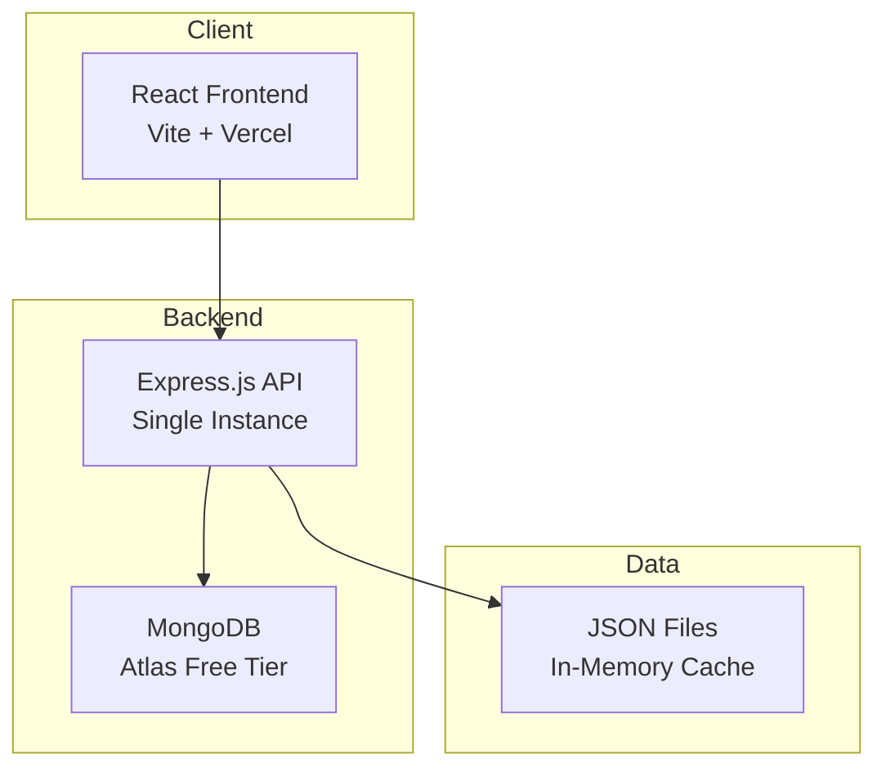
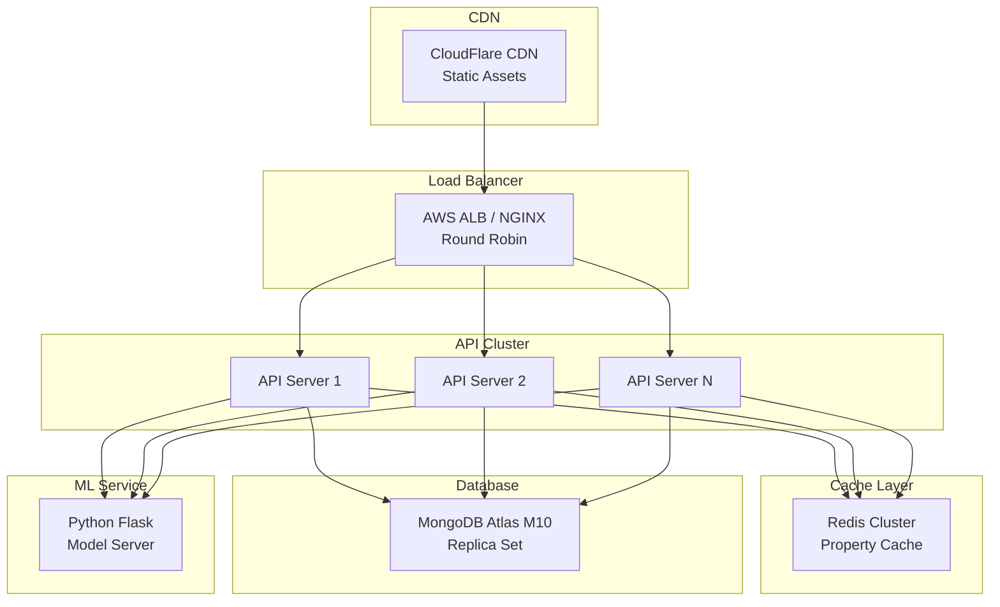
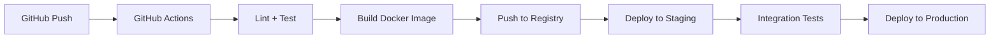

# 🏗️ System Architecture Document

## Overview

This document outlines the architecture for the PropertyAI recommendation system at two scale scenarios.

---

## Scenario A: 1,000 Users/Day

### Architecture Diagram



### Components

| Component | Technology | Hosting |
|-----------|------------|---------|
| Frontend | React + Vite | Vercel / GitHub Pages |
| Backend | Node.js + Express | Railway / Render |
| Database | MongoDB Atlas | Free Tier (512MB) |
| ML Model | In-process mock | Backend server |

### Characteristics
- **Single server** handles all requests
- **In-memory caching** for property data
- **~42 requests/hour** average load
- **Latency**: <200ms p95
- **Cost**: ~$0-10/month

---

## Scenario B: 20,000 Users/Day

### Architecture Diagram



### Components

| Component | Technology | Scaling Strategy |
|-----------|------------|------------------|
| Frontend | React + Vite | CDN edge caching |
| Load Balancer | AWS ALB | Auto-scaling groups |
| API Servers | Node.js + Express | 2-4 instances |
| Cache | Redis | Read-through cache |
| Database | MongoDB Atlas M10 | Replica set |
| ML Service | Python Flask | Separate container |

### Key Improvements

1. **Load Balancing**: Distribute traffic across multiple API instances
2. **Redis Cache**: Cache property data, reduce DB reads by 90%
3. **Dedicated ML Service**: Isolate model serving for better resource management
4. **CDN**: Edge cache static assets, reduce latency globally
5. **Database Scaling**: MongoDB replica set for read scaling

### Characteristics
- **~833 requests/hour** average
- **Auto-scaling** 2-4 API instances based on CPU
- **Latency**: <100ms p95 (cached), <300ms (cold)
- **Cost**: ~$100-200/month

---

## Monitoring & Logging Strategy

### Tools
- **APM**: New Relic / Datadog for performance monitoring
- **Logs**: Winston → CloudWatch / LogRocket
- **Errors**: Sentry for real-time error tracking
- **Uptime**: Pingdom / UptimeRobot

### Key Metrics
| Metric | Alert Threshold |
|--------|-----------------|
| API Response Time (p95) | > 500ms |
| Error Rate | > 1% |
| CPU Usage | > 80% |
| Memory Usage | > 85% |
| MongoDB Connection Pool | > 90% |

### Alerting
- **PagerDuty** integration for on-call rotation
- **Slack** notifications for warnings
- **Email** for daily summary reports

---

## Error Handling & Resilience

### Retry Logic
```javascript
// Exponential backoff for external services
const retry = async (fn, retries = 3, delay = 1000) => {
  try {
    return await fn();
  } catch (error) {
    if (retries === 0) throw error;
    await sleep(delay);
    return retry(fn, retries - 1, delay * 2);
  }
};
```

### Graceful Degradation
1. **MongoDB down**: Return cached recommendations, disable save feature
2. **ML service down**: Use price from property data, skip prediction
3. **Rate limiting**: Return 429 with retry-after header

### Circuit Breaker
- Implemented for external service calls
- Opens after 5 consecutive failures
- Half-open after 30 seconds

---

## CI/CD Pipeline



### Deployment Strategy
- **Blue-Green** deployment for zero downtime
- **Feature flags** for gradual rollouts
- **Automatic rollback** on health check failures

---

## Security Considerations

1. **HTTPS everywhere** via CloudFlare
2. **Rate limiting**: 100 req/min per IP
3. **Input validation**: Joi/Zod schemas
4. **CORS**: Whitelist frontend domains only
5. **Environment variables**: Secrets in AWS Secrets Manager
